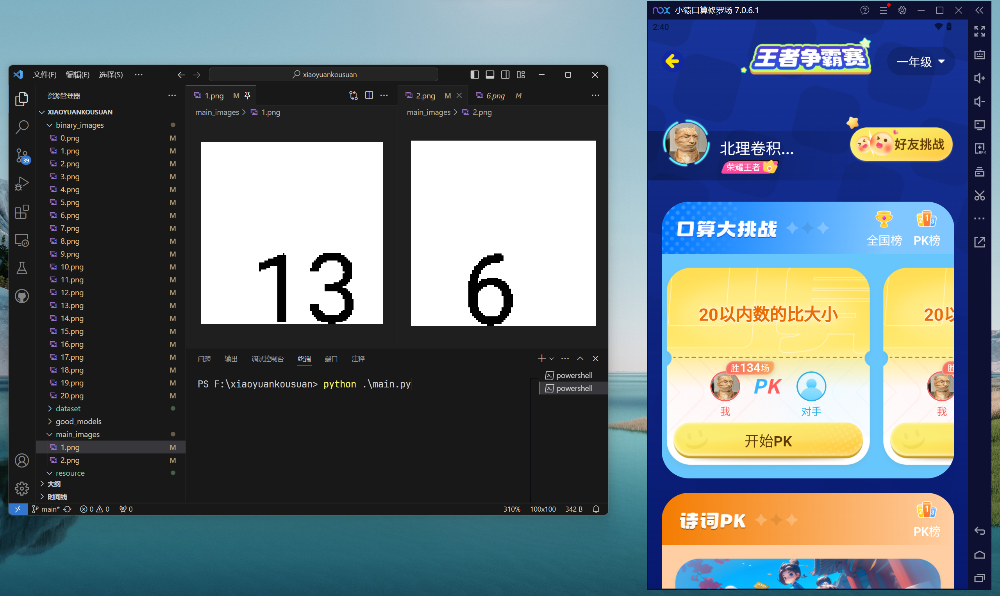
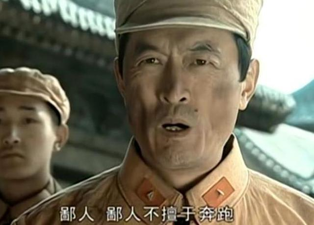

# 小猿口算：20以内比大小刷分脚本

## 环境配置
1. **安卓设备**：[夜神模拟器](https://www.yeshen.com/) Android 12，选择`手机版`，分辨率采用`1080*1920`，并安装`小猿口算`。
2. **Python 3.12**：通过以下指令安装所需的库。
   ```shell
   pip install -r requirements.txt
   ```
---

## 操作指南
1. **生成训练数据集**：运行以下指令，可以在文件夹`dataset`下找到生成的数据集`image_data.npy`和`labels.npy`。在`binary_images`下存放生成的0-20数字图像的样图。
   ```shell
   python ./create_dataset.py
   ```

2. **训练识别数字的卷积神经网络**：运行以下指令，可以使用上述生成的数据集训练识别0-20数字的卷积神经网络。模型的参数将保存至`saved_models/best_model.pth`。
   ```shell
   python ./train.py
   ```

3. **启动刷分**：将夜神模拟器的安卓虚拟机打开，并进入`小猿口算`的`口算PK`主界面。运行以下指令开始自动刷分！  
   **注意**：在刷分期间，请勿移动鼠标；如需移动，请先按下空格键以终止程序。
   ```shell
   python ./main.py
   ```
<div align=center>
    
</div>

---

## 脚本表现
本脚本并不以速度见长，平均速度在**1秒钟1道题目**，最佳表现是28秒做完30道题目。但是本脚本胜在全自动刷分，只需启动脚本就可以一直上分。
<div align=center>
    
</div>

---

## 目录结构
```
.
│  create_dataset.py     # 生成数据集的程序
│  main.py               # 运行脚本的主程序
│  README.md
│  requirements.txt      # 安装依赖库
│  Roboto-Regular.ttf     # 生成数据集所用字体
│  train.py              # 训练CNN的函数
│
├─binary_images          # 生成的数据集的样例，分别是0-20的图像
│      0.png-20.png
│
├─good_models            # 作者得到的较好的模型参数
│      best_model_10000.pth
│      best_model_20000.pth
│
├─main_images            # 脚本运行中识别数字的截图
│      1.png
│      2.png
│
├─resource               # readme文档所需的图片
│      not_good_at_run.png
│      records.png
│      start.png
│
└─saved_models           # 运行脚本使用的CNN参数
        best_model.pth
```

---

## 实现思路

### 为什么采用图像识别？
针对小猿口算PK的脚本，竞速的鄙视链是 **后台>抓包>图像识别**，鄙人不善奔跑，所以采用了图像识别的方法。作者尝试过使用抓包，请教网安大佬指导使用charles抓包，但是不幸的是当晚小猿加入了代理检测，在大佬指导的时候就经常遇到一开代理就进入不了PK界面，但是进入别的页面都没问题，后来作者实现的时候彻底封住了，代理被完全ban了。抓包脚本出师未捷，决定采取了最像人的图像识别来做。
<div align=center>
    
</div>


### 生成数据集的思路
做题的核心在于识别正确的数字，识别正确的数字的关键在于用足够高质量、足够符合实际截图情景的数据集训练卷积神经网络，作者自认为生成数据集的思路值得和诸君分享一下！

1. **小猿口算PK的题目显示逻辑**：
   - **纵向显示**：夜神模拟器中使用`Roboto-Regular`字体，在`手机版 1080*1920`的配置下，题目数字的Y方向像素范围是`414-454`，可用作截图参考线。
   - **横向显示**：通过抓取的`match`包，可以看到题目内容为类似格式的字符串，例如：
     ```json
     "content":"9\\circle20"
     ```
     所以其实我们在题目中看到的两个数字中间的白色圈似乎是被固定在中间的，但是其实每次居中的是整个题目`"9\\circle20"`。因此左边和右边的数字都是不固定从一个横向点开始生成的，这给划定区域造成了困难。幸运的是，不难发现，虽然数字有胖瘦，但是由于居中的限制，左右数字左右平移是有个限度的，而`100`像素足够cover这个偏离的距离的。
   - **最终的截图样子**：浅蓝色背景中一个黑色数字紧贴着底部，横向随机出现在某个位置，并且由于中间的白色圈的随机偏移，所以会有一部分会是白色的圈的一部分。

2. **去噪处理**：由于截图会出现浅蓝色背景和白色的噪声，截图的质量并不高。因此将图像转成灰度图，采用归一化去掉噪声，设置一个`threshold=128`，将比`threshold`高的像素都设置为白色，比`threshold`低的像素都设置为黑色。

3. **面向答案出题——构建数据集**：既然已经知道了截图处理成的去噪归一化图像，我们就对症下药！作者生成的数据集是在`100*100`画布上用`Roboto-Regular`字体画出纵向像素为40的数字，并将这个数字进行随机的偏移，最终得到的图像也进行去噪和归一化。

### 做题交互的思路
1. **绘制大于小于号**：单纯的模仿鼠标行为，作者是通过模仿拖拽的方式实现的的。作者看网上有通过画锚点就可以锁定出图像的方法，但是其实拖拽行为是可以控制`duration`的，所以这里并不是提速的核心。
2. **保证截图质量**：为了截图的稳定，必须在做题后加入0.5秒的等待时间，这也是图像识别方法不配上桌的根本原因，极限是上不了0.5秒一道题的，所以根本没法入榜，不配上桌！

### 死锁的发生与处理
1. **死锁的发生**：当识别的图像始终是同一个图像会发生死锁，识别的结果会导致题目继续停滞，从而卡住。
2. **死锁发生的原因**：核心原因是小猿口算系统的纠错等待机制。小猿口算是给了大家修改的机会的，在每一次抬手的时候，小猿都识别了当前已经画的图形，如果是正确答案，会直接秒过，所以连对速度会飞起。但是一旦发现当前不是正确答案，小猿会等待0.7秒让你纠错，这个罚时吃到了会很伤，会严重打乱图像识别的节奏，出现反复识别同一个图像的情况，如果逻辑只按照识别的数字进行比较大小，那么就会死锁在错误的题目上。因此如果单纯根据识别的数字就给出比大小的结果，这就对延迟提出了很高的要求：机器的交互响应必须是稳定的周期，模型的识别结果也不能有任何的失误，否则就会引入大量延迟从而陷入死锁。
3. **死锁发生的情况**：
  - 判断符号与答案相反，这是自然而然地引入罚时的。这都是由识别错误导致的。
  - 判断符号与答案相同，但是由于一些莫名的延迟导致鼠标的画图受到污染，从而识别不到正确的符号并引入了0.7秒罚时。
  
4. **死锁的解决**：针对第一种情况，很容易想到死锁了那就输出识别的两个数字大小关系相反的符号就可以了，事实上第一种就是这样解决的。但是如果只采取输出识别的两个数字大小关系相反的符号，那么第二种情况的死锁是无法解决的，因为识别同一张图，认出的本来正确的数字保持不变，大小关系保持不变，但是输出的符号是反的，所以会一直判断错。综上所述，作者采取了计数错误次数的方法解决死锁，不可谓不机智，并将错题的最大时间放到了2.1秒，保证了刷分的持续性和速度。

---
